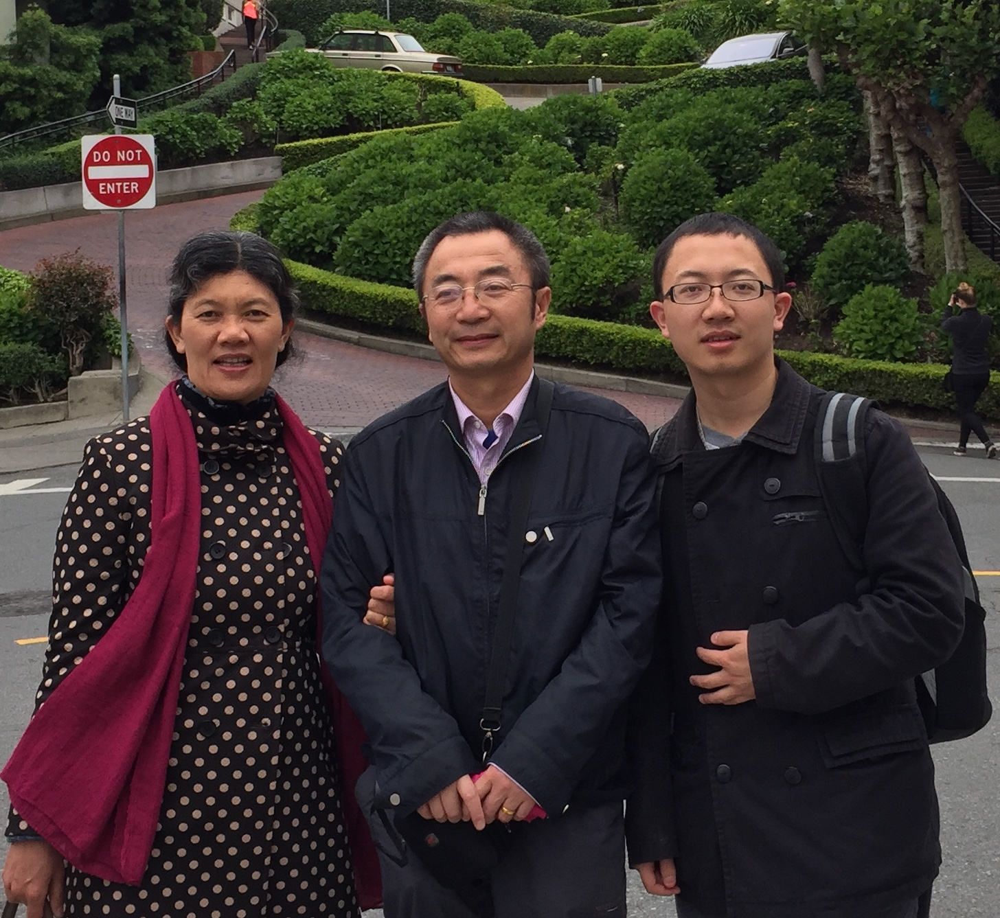
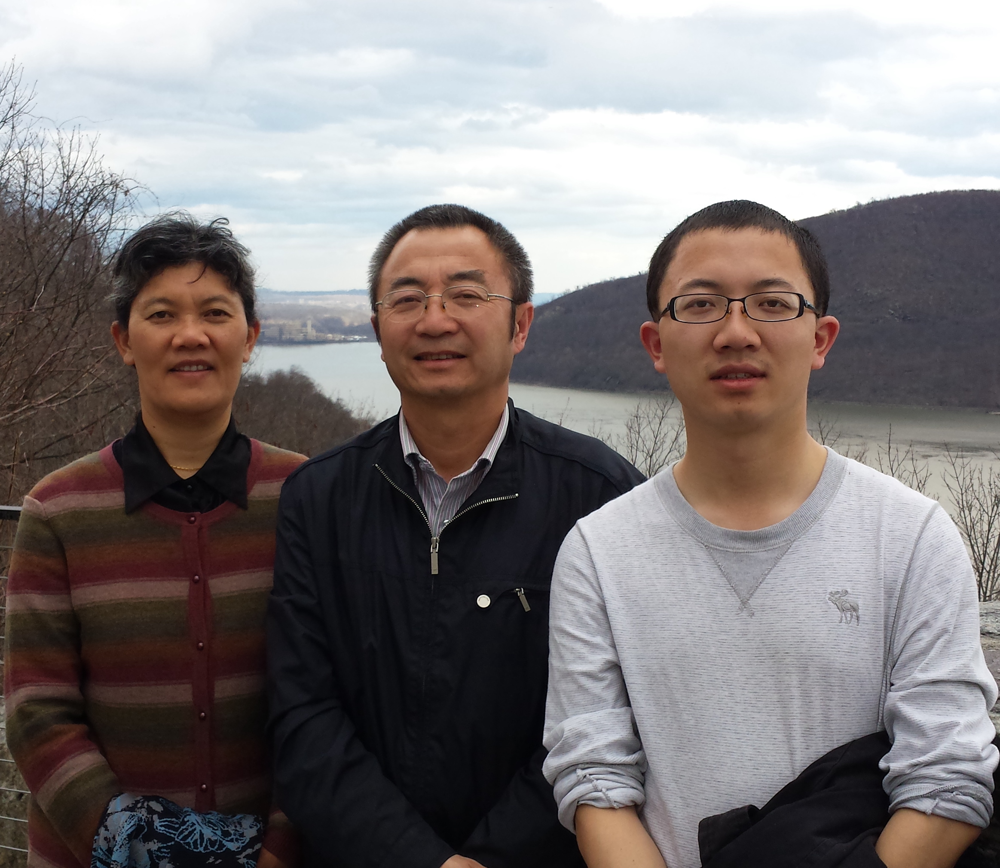
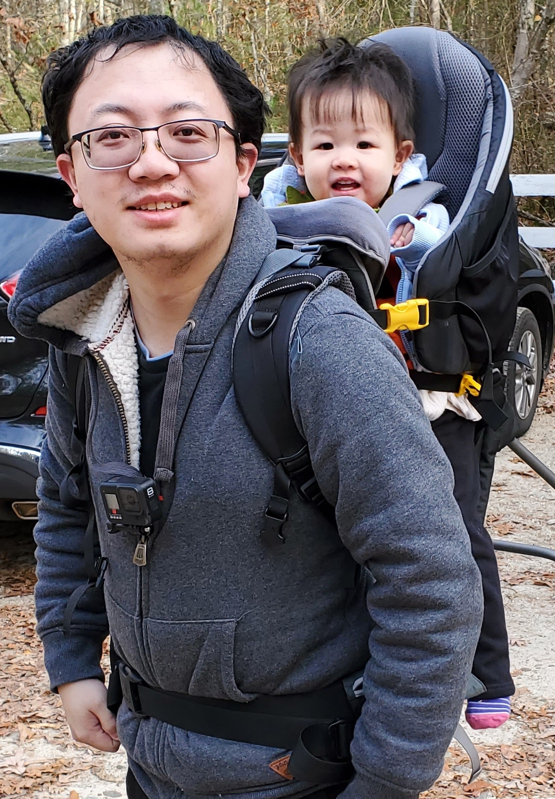
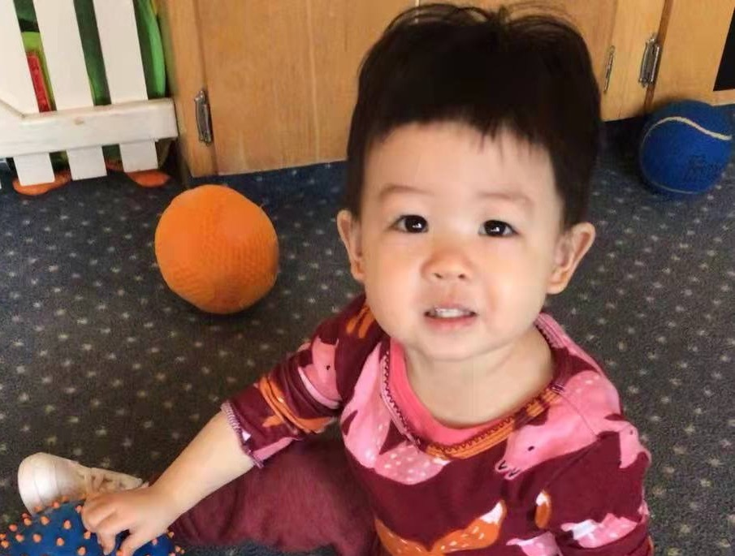

```{r setup, include = FALSE}
library(knitr)
library(tidyverse)
library(xaringanExtra)
library(icons)
# set default options
opts_chunk$set(echo=FALSE,
               collapse = TRUE,
               fig.width = 7.252,
               fig.height = 4,
               dpi = 300)

# set engines
knitr::knit_engines$set("markdown")
# 
xaringanExtra::use_tile_view()
xaringanExtra::use_panelset()
xaringanExtra::use_clipboard()
```

class: title-slide, right, top
background-image: url(figures/icon-512.png), url(figures/frame-art.png)
background-position: 90% 75%, 75% 75%
background-size: 8%, cover

.right-column[
# `r rmarkdown::metadata$title`
### `r rmarkdown::metadata$subtitle`

**`r rmarkdown::metadata$author`**<br>
`r rmarkdown::metadata$date`
]

.palegrey[.left[.footnote[Graphic by [Vernon Adams](https://www.rawpixel.com/image/575297/artistic-canvas-background-template)]]]

???

Welcome to the workshop on sharing your work with xaringan.

Where I'll show you how to create impressive presentation slides that can be deployed to the web for easy sharing.

---
name: about-me
layout: false   
class: about-me-slide, inverse, middle, center

# About me


## Guangyu Zhu

### Assistant Professor

.fade[University of Rhode Island<br>Kingston, RI, USA]

[`r fontawesome::fa("link")` guangyuzhu.rbind.io](https://guangyuzhu.rbind.io)


---
layout: true

<a class="footer-link" href="https://guangyuzhu.rbind.io">guangyuzhu.rbind.io &mdash; Guangyu Zhu</a>

<!-- this adds the link footer to all slides, depends on footer-link class in css-->

---
class: top

# 爷爷奶奶

.pull-left-narrow[
```{r,out.width='100%'}

```
]

.pull-right-wide[
*爷爷*
]

--

.pull-left-narrow[
```{r,out.width='100%'}

```
]

.pull-right-wide[
*奶奶*
]

---

## Panels

.panelset[
.panel[.panel-name[Guangyu Zhu]
.pull-left-narrow[
.center[
```{r,out.width='100%'}

```
]
]

.pull-right-wide[
```{r}
knitr::include_url("https://guangyuzhu.rbind.io")
```
]
] <!---->


.panel[.panel-name[Tingting]
.pull-left[
.center[
Chang Chun
]]

.pull-right[
```{r,out.width='100%'}

```
]
] <!---->


.panel[.panel-name[Luciana]
.pull-left[
.center[
Born
]]

.pull-right[
```{r,out.width='100%'}

```
]
] <!---->
] <!--end of panelset-->


